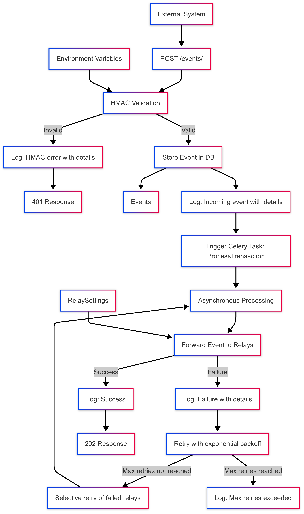

# EventPulse

**EventPulse** is a Django-based event relay and logging platform designed for secure, scalable, and auditable event integrations. It demonstrates best practices in API design, event-driven architecture, and system integration—key skills for an Integration Engineer.

---

## 💡 Why EventPulse?

This project is to demonstrate my ability to design, implement, and document a real-world integration platform, focusing on security, reliability, and scalability—qualities essential for an Integration Engineer.

---

## 🚀 Features

- **Secure Event Intake:**  
  Receive events via REST API with HMAC signature validation using environment variables for secure key storage.

- **Flexible Relay System:**  
  Configure multiple relay endpoints (webhooks, APIs, etc.) with support for API keys/secrets.

- **Asynchronous Processing:**  
  Uses Celery for background event processing and forwarding with robust retry logic and exponential backoff.

- **Comprehensive Logging:**  
  All events and processing steps are logged with detailed contextual information for traceability, debugging, and audit purposes.

- **Admin/CRUD Interface:**  
  Manage relays and view logs via API endpoints.

---

## 🏦 Adyen Payment Webhook Integration

EventPulse is specifically designed to handle payment webhooks from Adyen, making it a practical showcase for real-world integration engineering challenges.

### Security Expectations

- **Basic Authentication:**
  - The webhook endpoint requires HTTP Basic Auth, as expected by Adyen. You must configure a username and password in Adyen's Customer Area and in your EventPulse environment.
- **HMAC Signature Validation:**
  - Each webhook payload is signed by Adyen using an HMAC signature. EventPulse validates this signature according to Adyen's official documentation to ensure authenticity and integrity.
  - The HMAC key is securely stored in environment variables rather than in the database.

### Payload Structure

Adyen sends payment webhooks with a JSON payload containing fields such as `pspReference`, `eventCode`, `merchantAccountCode`, and more. EventPulse extracts and logs all relevant fields for traceability and idempotency.

### Idempotency

EventPulse checks the unique `pspReference` from Adyen to prevent duplicate processing of the same event, ensuring safe and reliable integrations.

### Testing with Postman

- A Postman collection is included (or available upon request) to simulate Adyen webhook calls, including examples for:
  - Valid and invalid HMAC signatures
  - Correct and incorrect Basic Auth credentials
  - Sample Adyen payment webhook payloads
- To test:
  1. Import the collection into Postman.
  2. Set the Basic Auth credentials and HMAC key to match your local configuration.
  3. Send sample webhook requests to `http://localhost:8000/api/events/` and observe the response and logs.

---

## 🛠️ Tech Stack

- Python 3, Django, Django REST Framework
- Celery (for async tasks)
- Docker & Docker Compose (for easy setup)
- PostgreSQL (default, can be swapped)
- HMAC, UUID, and secure API design patterns

---

## 📦 Project Structure

```
EventPulse/
├── Dockerfile, docker-compose.yml
├── requirements.txt
├── src/
│   ├── manage.py
│   ├── config/         # Django project settings
│   └── apps/
│       └── eventpulse/ # Main app: models, views, tasks, etc.
```

---

## ⚡ Quickstart

### 1. Clone & Configure

```bash
git clone https://github.com/yourusername/eventpulse.git
cd eventpulse
cp -r envs-example envs  # Set up environment variables
```

### 2. Run with Docker

```bash
docker-compose up --build
```

### 3. Create Superuser

```bash
docker-compose exec event-pulse python src/manage.py createsuperuser
```

### 4. Access

- API: `http://localhost:8000/api/`
- Admin: `http://localhost:8000/admin/`

---

## 📝 Example Usage

- Use the Postman collection for examples on how to use the API.
- Remember to set the Basic Auth credentials and HMAC key to match your local configuration.

---

## 📊 Event Flow



---

## 🛡️ Security & Best Practices

- HMAC-based event authentication with keys stored in environment variables
- API key/secret management for relays with field-level encryption using Fernet
- Structured, detailed logging for all integration points with contextual information
- Selective retry mechanism for failed relay destinations
- Exponential backoff strategy for retries with configurable limits

---

## 📚 Next Steps / Improvements

- Add OpenAPI/Swagger documentation
- ✅ Implement retry/backoff for failed relays
- ✅ Encrypt sensitive fields in the database using Fernet
- Add more relay types (e.g., message queues, email)
- Expand test coverage for retry logic and error scenarios
- Implement rate limiting to protect against webhook flooding
- Add alerting mechanisms for events that exceed maximum retry attempts

---

## ⚠️ Warnings

- This project is a work in progress and is not production ready.
- I properly have made mistakes, use this project at your own risk.

---

## 📬 Contact

If you’d like to learn more or discuss integration engineering opportunities, please reach out!
